# Game of Kings
For my second portfolio project with Code Institute I built a game based on a game I play often with friends called **Kings**.

**Kings** is a simple, fun (and addictive) card game suitable for all ages. Exercises the player's memory and strategy skills. 
This project will develop my skills in JavaScript, currently building it as a single player VS Robot players or multiple players using the same device.

The objective of the game is to score as low as possible, with Kings being worth zero points, the remainder as their numerical value (Jacks and Queens are worth 10pts).

**How is it played:** 
**Set up** 
1) Cards shuffled, each player is dealt 4 cards face down, remaining deck placed in the centre as a draw stack and the top card is turned over to form the discard stack.
2) Players will arrange their 4 cards in a 2 x 2 formation in front of them. This helps with the memory aspect of the game.
3) Without looking at their hand, the players can opt to shuffle their cards around in their 2 x 2 formation in the hope it may reveal the larger value cards in the next step.
4) Before play begins, the dealer counts down "3, 2, 1!" where on "1", players can look at only the bottom 2 cards of their hand for about 1 second. Cards are placed back down and no further shuffling is allowed from this point.

**Playing the game**
1) The player to the left of the dealer goes first, taking turns clockwise.
2) Knowing only the bottom 2 cards of their hand, the player must choose to either draw the top card from the discard stack (since it is visible and may be significantly lower than just seen in their hand) or take a chance and pick from the draw stack. Once they see the card they have picked, they can choose whether to swap with any of the ones in their hand or to discard it.
3) Each player takes a turn by choosing to pick a card from either stack and deciding whether to swap with another from their hand or not.
4) Before moving on to the next player, the current player may knock on the table to indicate they are locking in their hand, indicating this is the last round for everyone else as this player believes they have the lowest scoring hand on the table.
5) Once the last player, the one to the right of the person that locked their hand has picked up a card and decided whether to swap or not, it is time for the locked in player to reveal their hand. Remember, they believe they have the lowest scoring hand on the table, should they not, their points are doubled.
6) The game goes on in several rounds of the above until one of the players has reached at least 200pts. The winner of the game has the lowest score of the table.

**Other Scenarios**
- What happens if there are no more cards in the draw stack?
  - collect all but the top card from the discard stack and shuffle to use this as the new draw stack.
- Scoring example.
  - If the knocking player had 2x kings, 1x 3 and 1x 4. This totals to 7 points in that round.
  - Should another player on this round score 7 points or lower, the knocking player's score doubles to 14.

The goals of this website are:
- To entertain visitors
- Potentially adding multiplayer features later to enable friends to compete remotely.

[View the deployed website here](https://dasic002.github.io/GameOfKings/)

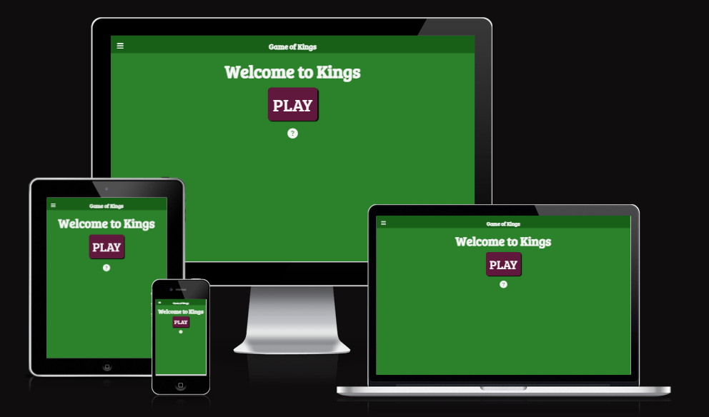

## UX - User Experience

### User stories
#### First time player
- Upon visiting the site the first time I don't want to be overloaded with a lot of information. I want the option to simply proceed to the game rather than be prompted with the instructions.
- I want to be able to start the game with the least amount of clicks necessary.
- I want to be able to refer to the instructions mid play without losing the current state of my game.

#### Real life player introduced to the digital version
- I want the gameplay to be as accurate to the real-life game, this means:
  1) being able to knock (lock my hand) on first sight of my hand.
  2) being able to see what the other players have done as I would playing around the table. They give me clues as to how well their game is going.

#### Returning player
- I want to be able to play the game on any device, be it a desktop PC or my mobile.
- Want to share the game with friends and play against them.

### Strategy

Build a minimalist website that keeps the focus of the player on current step of the game and provides the information as succinctly and intuitively as possible.

### Scope

Give the visitor a fun game to play that provides as much of the real life fun the game of kings provides when playing with friends.

### Structure

A single page that reveals different sections with game play or menu items. The page is composed of the following sections:
- **Header** - Contains title of the page, visible always.

- **Menu** - the hamburger/bars icon visible always.

- **How to play** - hidden until selected in menu or ? icon button clicked. This section is composed of several subsections for step-by-step instructions on how to play the game. Navigation buttons become available to go through the steps.

-  **Credits** - hidden until selected in menu. It will hold credits pertaining to the site composition and inspiration and a link to the gitHub repository.

- **Game-area** - visible on loading of page, whenever How to play or Credits section is hidden. Composed of other subsections to navigate through the game:
  - Welcome - visible on page load.
  - Player form - visible on clicking the start button or New Game in the Menu. Players can enter their name, in the absence of names, the website presumes those fields as bot players.
  - Other players - displays the other players' information.
  - Decks area - presents the draw and discard stacks to pick from.
  - Main player - presents the current player's information.
  The Game-area is manipulated by JavaScript to present the live game information and prompt actions from the human player.

### Skeleton

[Landing Page](documentation/PP2-GameofKings-LandingPg.jpg)

[Nav Menu](documentation/PP2-GameofKings-navMenu.jpg)

[Player entry form](documentation/PP2-GameofKings-playerEntryForm.jpg)

[Player Prompt](documentation/PP2-GameofKings-playerPrompt.jpg)

[Card hand setup for first reveal](documentation/PP2-GameofKings-cardHandSetup.jpg)

[Table Setup](documentation/PP2-GameofKings-tableSetup.jpg)

[Game play](documentation/PP2-GameofKings-gamePlay.jpg)

### Surface
#### Colour theme
For the Classic card game look, palette made up of 2 greens and a deep purple and off white and black. The dusty (lighter green) used to mimic the sort of matte finish of felted card tables, whilst the dark green offers better contrast for information pertaining to the players. The deep purple was selected on buttons so it compliemented the greens chosen and offered plenty of contrast to its labels in the off white colour. This palette was used to create a fun and reminiscient feel of card games whilst still offering a comfortable viewing experience.

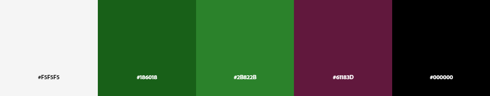

<!-- #### Typography -->

## Technologies
- Languages used:
  - [HTML5](https://en.wikipedia.org/wiki/HTML5)
  - [CSS3](https://en.wikipedia.org/wiki/CSS)
  - [JavaScript](https://en.wikipedia.org/wiki/JavaScript)
- [GitPod](https://www.gitpod.io/) - Cloud-based IDE to edit code and Git version control.
- [Github](https://github.com/) - to store and publish the project.
- [Google Fonts](https://fonts.google.com/) - to import fonts "Comfortaa" and "Dosis" into the website's CSS.
- [Font Awesome](https://fontawesome.com/) - to import icons for more recognizable action buttons. It has been used in:
  - The expandable Nav bar on narrow displays.
  - The X icon in expandable projects section.
  - The clear and submit form.
  - The contact platforms in the footer.
- [FavIcon generator](https://favicon.io/) - used to create the favicons to embed on our site.
- [Am I Responsive](https://ui.dev/amiresponsive) - to visualise the website in various display sizes.
- [Adobe Color](https://color.adobe.com/create/color-wheel) - to generate the colour palette and Accessibility tools checking for contrast for legibility and colour-blind viewing.
<!-- - [Tiny PNG](https://tinypng.com/) - to compress images for faster page loading. -->
- [W3C HTML Validator](https://validator.w3.org/) - to validate the HTML code.
- [W3C CSS Validator](https://jigsaw.w3.org/css-validator/) - to validate the CSS code.
- [JS hint](https://jshint.com/) - to validate the JS code.

## Features 

### Existing Features

- __Navigation Menu__
  - The navigation is set to an absolute position so no matter what content is displayed it is always available at the top of the page.
  - The buttons included **New Game**, **How To Play** and **Credits** make these sections of the page visible, rather than navigate to separate pages or extend the page length.
  - Aligned to the top left corner, it is displayed as an expandable "burger" icon menu. 
  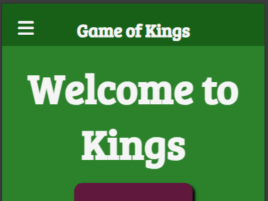 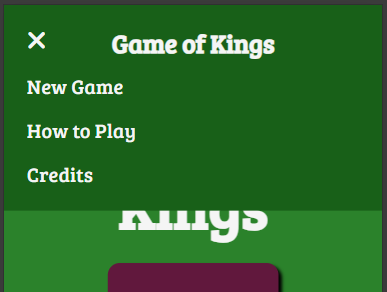
  - On wider displays, the navigation menu remains the same expandable icon. 
  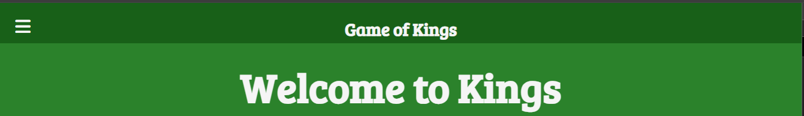
  - The virtually white text over the dark green background remains contrasting enough and in keeping with the classic card game look.

- __The landing page - Welcome__
  - The landing page consists of a simple Heading "Welcome to Kings", big "PLAY" button and a "?" icon button. 
  - Just so it offers the main point of focus, to play the game. The "?" icon button is there to offer a support, should the player not know the game, it makes it convenient for the visitor to easily reveal the instructions. 
  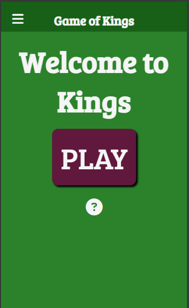

- __How to Play__
  - This section revealed on clicking the "How to play" button in the menu or the "?" icon button on the landing page or player prompts, contains various subsections providing instructions with illustrations on how to play the game of kings. 
  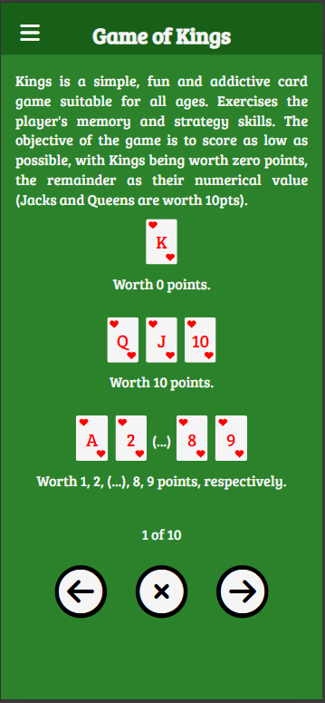 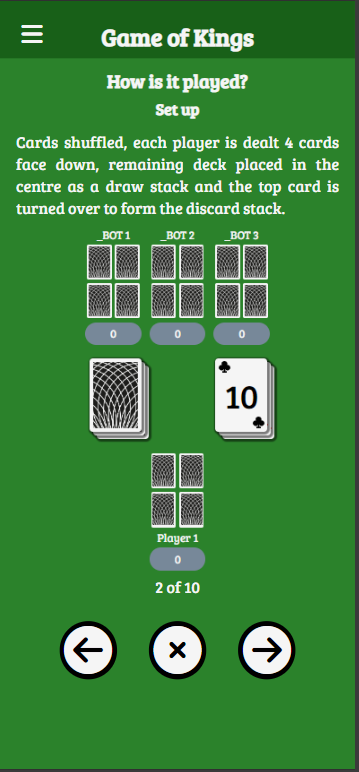 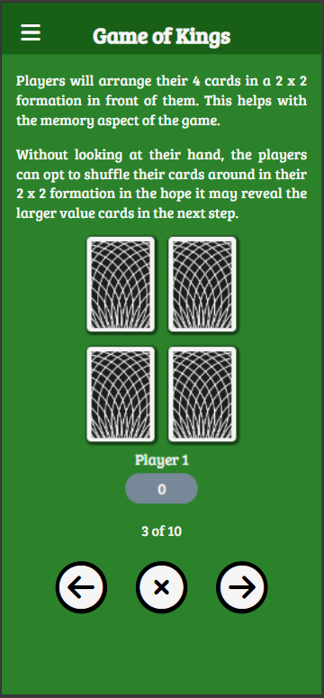 
  - The steps are provided in subsections that are navigated using the left and right arrow buttons at the bottom. Whilst the "X" button returns to the game area, this is so the player can refer to the instructions at any time and easily resume their game. 
  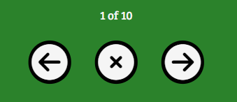 

<!-- - __Credits__
  - Includes mentions to those that taught me the game, a link to the repository and a link to contact via my business (Studio Silva) whatsapp. 
  

- __The Footer__ 
  - The footer contains links to my company's instagram page, my personal Linkedin profile, my company's whatsapp contact and etsy shop.
  - Should the visitor prefer to contact outside of the form, they are welcome to reach out via these means. 
  

- __Error 404 Page__
  - A page in keeping with the style of the main page of the site to indicate the visitor as stumbles upon an non-existent URL of our site and to point them back to our homepage. 
   -->

### Features Left to Implement
<!-- - Navigation hamburger icon to change to a cross when expanded to give a visual clue on how to close the menu.
- Make the navigation menu collapse on clicking a link that redirects to section on page.
- Create a projects page that includes a lot more detail on the projects described in the project section. When a visitor expands a project there could be a link for "More >>" which redirects to the section in the projects page that shows more information.
- A "thank you" message to replace the contact form when the form gets submitted successfully and that the form contents get forwarded to my email address to contact back. -->

## Testing 

### Validator Testing 

- HTML
  - No errors were returned when passing through the official, just warnings on use of aria-labels on span elements [W3C validator](https://validator.w3.org/nu/?doc=https%3A%2F%2Fdasic002.github.io%2FCarlos-Da-Silva-Folio%2Findex.html) 
  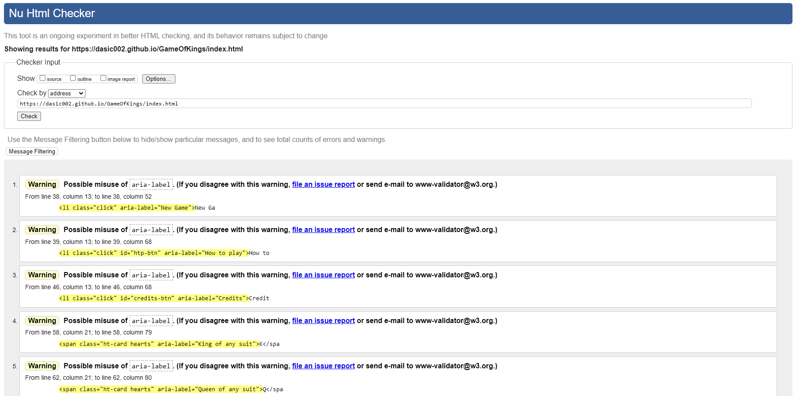
- CSS
  - No errors were found when passing through the official [(Jigsaw) validator](https://jigsaw.w3.org/css-validator/validator?uri=https%3A%2F%2Fdasic002.github.io%2FGameOfKings%2Findex.html&profile=css3svg&usermedium=all&warning=1&vextwarning=&lang=en) 
  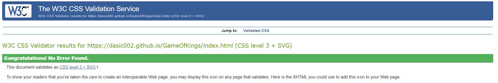 
- JavaScript
  - No errors were found when passing through [JS hint error checker](https://jshint.com/) 
  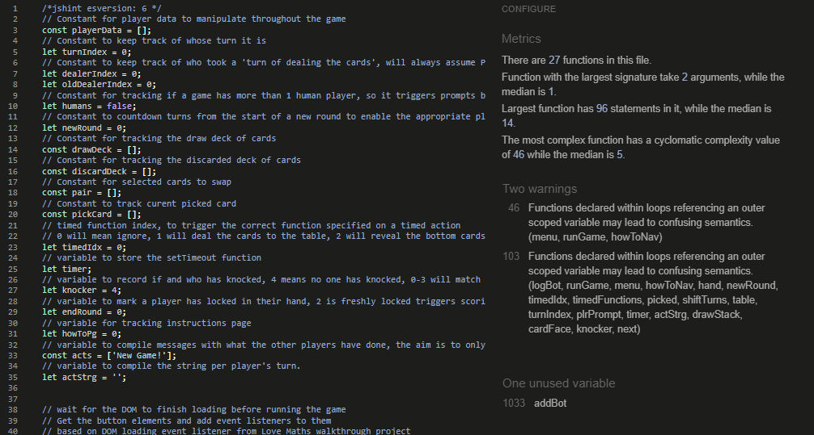
- Accessibility
  - Running the site through lighthouse analysis confirms the colours and fonts used legible and accessible on either:
    - Mobile: 
  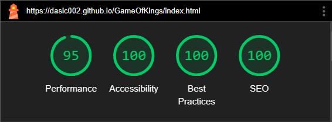
 
    - Desktop: 
  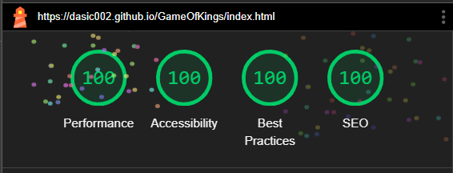

  - Running the site through [WAVE accessibility tool](https://wave.webaim.org/report#/https://dasic002.github.io/GameOfKings/index.html) showed no obvious errors after some improvements were made. 
  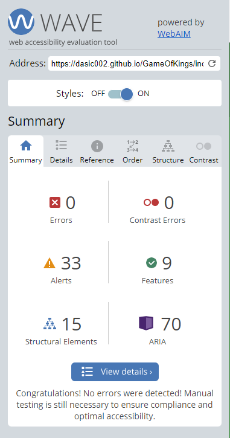

### Manual Testing

#### Devices and browsers used
<!-- - iPhone 12 Pro - iOS 17.4.1
  - Safari (v17.4.1)
  - Chrome (v126)
  - Google (v319)

- iPad Pro (12.9 inch - 4th Gen) - iPadOS 17.4.1
  - Safari (v17.4.1)
  - Chrome (v125)

- Dell Precision 3510 laptop - Windows 10 Pro (2H22)
  - Chrome (v125)
  - Firefox (v126)
  - Microsoft Edge (v125) -->

#### Manual testing checklist

<!-- | Feature | Action | Expected Behaviour | Pass/Fail | Notes |
|-|-|-|-|-|
|Google fonts|Loading the page|Google fonts load|PASS|
|Font awesome icons|Loading the page|Icons appear as intended|PASS|
|Images|Loading the page|images appear as intended|PASS|
|content text |Loading the page|text appears as intended|PASS|
|Nav bar appearance|Loading the page|Nav bar appears as expected, collapsed hamburger icon for narrow displays, expanded along the width for medium and wider displays.|PASS|
|nav bar hamburger icon|Click Hamburger icon|hamburger icon expands to reveal nav menu|PASS|
|Nav link - Home|Click link "Home"|link navigates to welcome section / landing page|PASS|
|Nav link - Projects|Click link "Projects"|link navigates to projects section of site|PASS|
|nav link - Contact Us|Click link "Contact Us"|link navigates to contact us section|PASS|
|Projects - mobile|Click to expand|Project div expands to reveal image and project brief.|PASS|
|Projects - mobile|Click others to expand|Previously expanded project closes when other expands.|PASS|
|Projects - mobile|Click X icon to close|Current expanded project closes.|PASS|
|Projects - 600px wide|page load|Projects are expanded with text to the side of the image.|PASS|
|Projects - 1500px wide|page load|Projects are expanded with text below images and lined up in a row across the width of the page.|PASS|
|Contact form - visual|page load|Contact form maintains intended appearance, with no additional controls.|PASS|
|Contact form|Submit form without entering First name|Form prompts user to fill in field.|PASS|
|Contact form|Submit form without entering Surname|Form prompts user to fill in field.|PASS|
|Contact form|Submit form without entering email|Form prompts user to enter an email address in field.|PASS|
|Contact form|Submit form without entering an "@" sign in the email field|Form prompts user to enter an email address in field.|PASS|
|Contact form|Submit form without entering a message in the textarea field|Form prompts user to fill in field.|PASS|
|Contact form|Submit form upon entering valid data|Page loads CI's formdump with data received.|PASS|
|Contact form|Click on eraser icon|Form fields are cleared.|PASS|
|Footer - hover|hover the cursor over link icons|Icons should be surrounded with black circular background|PASS|
|Footer - links|Click Instagram icon|Opens Studio Silva's instagram page on new tab.|PASS|
|Footer - links|Click Linked in icon|Opens Carlos Da Silva's Linked In profile|PASS|
|Footer - links|Click Whatsapp icon|Opens Studio Silva's WhatsApp contact|PASS|
|Footer - links|Click Etsy icon|Opens Carlos' Etsy page|PASS|
|Error 404 page|Enter non-existing URL for the site|Calls up custom 404.html|PASS|
|Error 404 page|on page loading|Footer is fixed at the bottom of the display, there is no length to scroll unless content is longer than viewport height.|PASS|
|Error 404 page|Click on the Home button|Brings viewer back to main page|PASS|

 -->

### Unfixed Bugs

<!-- - __Nav Bar - turning fully black on expanding__ 
The intended look was to have this floating hamburger icon that when clicked the menu expands with a black to clear gradient from the top. The checkbox input to toggle open the menu works, but does not seem to accept addressing the whole header section to create this effect. The current compromise created is to have a permanent black to clear gradient from the top that extends as high as the section is, i.e.: when collapsed it is only as high as necessary for the hamburger icon and has high as the list menu when it is expanded. 

- __Nav Bar - using section IDs on nav list__ 
Using Section IDs for the navigation of the site means the menu does not toggle off on clicking them. Tried using the label element to wrap the anchors to trigger the checkbox that expands the nav menu:
  - wrapping the visible text of the anchor with the label toggles the checkbox, but does not navigate to their section at the same time.
  - wrapping the anchor with the label, navigates but does toggle the checkbox.

  Seems this requires some javascript to do this. Even the alternative of having the hamburger/bars icon replaced with a X icon when the menu is expanded seems to require javascript. -->

## Deployment

The site was deployed to GitHub pages following the steps outlined below:
- Log in to GitHub and navigate to the Github Repository.
- On the Repository page, select the settings icon just above the Repository title.
- In the sidebar to the left, select "Pages" under the "Code and automation" section.
- Under **Source**, select the "Deploy from a branch" from the dropdown menu, then under **Root** select "Main branch" from that dropdown menu.
- Make sure the "/root" is selected for the folder and click Save.

The page will be automatically refreshed and a link to the deployed site will be available on a ribbon display just at the top of the GitHub Pages webpage.

The deployed page can be found [here.](https://dasic002.github.io/GameOfKings/)

## Credits 

### Content 
- Icons used in the nav bar, some buttons and indicators were sourced from [Font Awesome](https://fontawesome.com/)
- Fonts used in the whole site sourced from [Google fonts](https://fonts.google.com/)
- All text written by developer

### Media
- Artwork for card back and suits icons generated by the developer.

### Code

- Media Query based on aspect ratio found in this article [The Complete guide to CSS Media Queries by PolyPane](https://polypane.app/blog/the-complete-guide-to-css-media-queries/#:~:text=taller%20than%201600px.-,Aspect%20ratio,%2Daspect%2Dratio%20media%20features.).

- Guidance on creating a nav menu toggle [using JavaScript](https://www.w3schools.com/howto/howto_js_mobile_navbar.asp).

- Reference on methods to distinguish clickable elements in the eventListener. [getAttribute()](https://developer.mozilla.org/en-US/docs/Web/API/Element/setAttribute) and [includes()](https://developer.mozilla.org/en-US/docs/Web/JavaScript/Reference/Global_Objects/String/includes).

- References on finding and manipulating array entries using [indexOf()](https://developer.mozilla.org/en-US/docs/Web/JavaScript/Reference/Global_Objects/Array/indexOf), as well as pop(), push(), shift(), unshift(), slice() and splice().

- JavaScript guidance for [moving an array entry to another position](https://www.geeksforgeeks.org/how-to-move-an-array-element-from-one-array-position-to-another-in-javascript/?ref=lbp), used for manipulating player's card hand when shuffling their position at the start or when they are swapped for something picked from the table.

- JavaScript code to find duplicates in an array, copied from [Checking for duplicate strings in JavaScript array](https://stackoverflow.com/questions/49215358/checking-for-duplicate-strings-in-javascript-array).

- JavaScript guidance on [setTimout()](https://www.w3schools.com/js/js_timing.asp) function to create the countdown to reveal and for the bell/knocking button.

- How to prevent buttons placed inside a form element from refreshing the page using [type="button"](https://stackoverflow.com/questions/7803814/how-can-i-prevent-refresh-of-page-when-button-inside-form-is-clicked) attribute in button HTML element.

- Inspiration for the function of the add Bot player buttons, using the [onclick attribute](https://www.w3schools.com/howto/howto_html_clear_input.asp) to trigger a function.

- Guidance to position the navigation buttons in How To Play section [using CSS](https://www.w3schools.com/howto/howto_css_center_button.asp).

- Guidance to generate the CSS to style the elements as cards, using multiple backgrounds and transforming them to build the look of the cards to minimise the image file size [MDN background](https://developer.mozilla.org/en-US/docs/Web/CSS/background).

<!-- - CSS and HTML code for the nav bar in the header was originally taken from the [Love Running walkthrough project](https://github.com/dasic002/Love-Running), then CSS was altered for the intended look.
- CSS and HTML code for the function of expanding and collapsing of project snippets sourced from [Web mdn docs references for the pseudo :checked](https://developer.mozilla.org/en-US/docs/Web/CSS/:checked).
- Guidance on how to increase the general font-size viewed on the page as display goes beyond 4K resolution. [Learnt about html{font-size: ;} function here](https://developer.mozilla.org/en-US/docs/Web/CSS/font-size)
- Guidance on how to prevent the contact form text area from being resized. [Learnt about textarea{resize: none;} function here](https://developer.mozilla.org/en-US/docs/Web/HTML/Element/textarea)
- Guidance on using background function for the images under a division. [background shorthand](https://developer.mozilla.org/en-US/docs/Web/CSS/background) -->

### Acknowledgement
- My mentor Brian Macharia for his insight, guidance and words of encouragement.

<!--## Other General Project Advice

 Below you will find a couple of extra tips that may be helpful when completing your project. Remember that each of these projects will become part of your final portfolio so it’s important to allow enough time to showcase your best work! 

- One of the most basic elements of keeping a healthy commit history is with the commit message. When getting started with your project, read through [this article](https://chris.beams.io/posts/git-commit/) by Chris Beams on How to Write  a Git Commit Message 
  - Make sure to keep the messages in the imperative mood 

- When naming the files in your project directory, make sure to consider meaningful naming of files, point to specific names and sections of content.
  - For example, instead of naming an image used ‘image1.png’ consider naming it ‘landing_page_img.png’. This will ensure that there are clear file paths kept. 

- Do some extra research on good and bad coding practices, there are a handful of useful articles to read, consider reviewing the following list when getting started:
  - [Writing Your Best Code](https://learn.shayhowe.com/html-css/writing-your-best-code/)
  - [HTML & CSS Coding Best Practices](https://medium.com/@inceptiondj.info/html-css-coding-best-practice-fadb9870a00f)
  - [Google HTML/CSS Style Guide](https://google.github.io/styleguide/htmlcssguide.html#General)

Getting started with your Portfolio Projects can be daunting, planning your project can make it a lot easier to tackle, take small steps to reach the final outcome and enjoy the process!  -->

